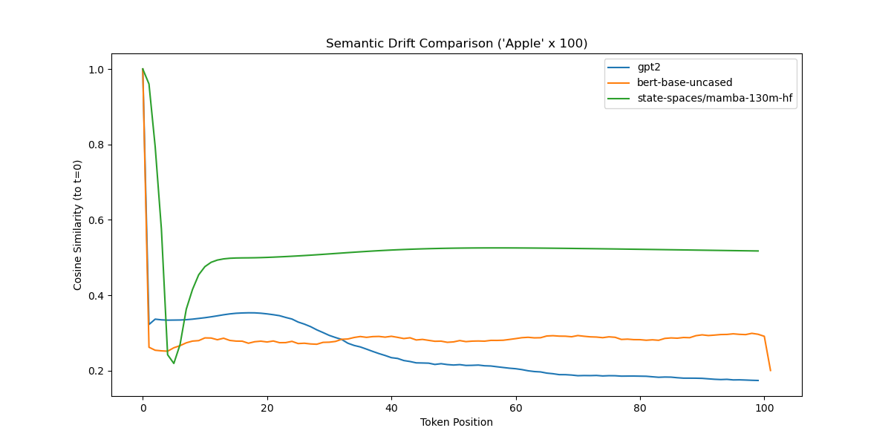
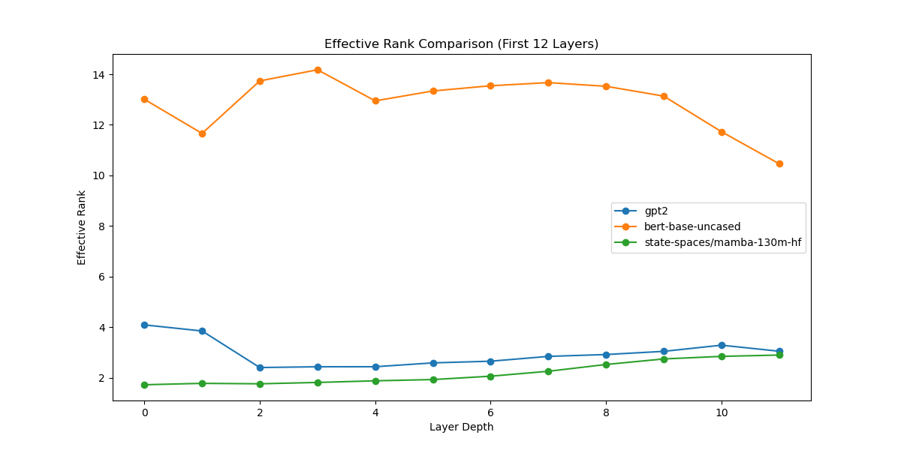
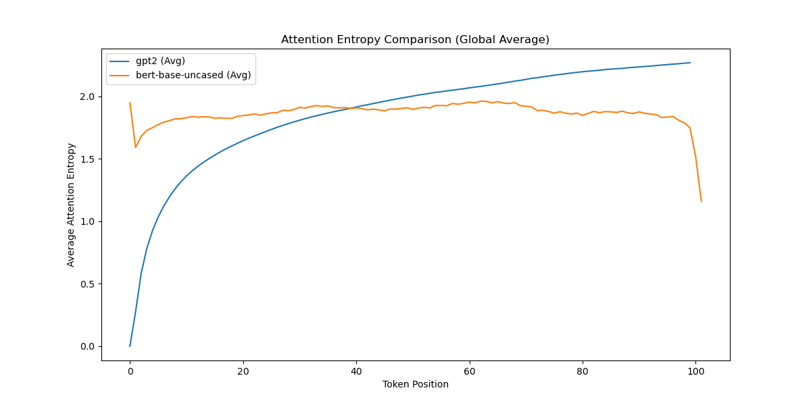

# Computational Gestalt Zerfall
## Investigating Semantic Satiation and Latent Manifold Collapse in Deep Neural Networks

**Author:** Yoonseong Jeong
**Date:** 2026-01-18

---

### 1. Abstract
This research project interrogates the phenomenon of **"Gestalt Zerfall"** (Gestalt decomposition or semantic satiation) through the lens of **Computational Phenomenology**. By subjecting distinct neural architectures—Causal Transformers (GPT-2), Bidirectional Encoders (BERT), and State Space Models (Mamba)—to extreme repetitive stimuli, we investigate whether the "loss of meaning" observed in biological cognition manifests as a **topological collapse** or a **geometric drift** within the artificial latent manifold.

Our findings reveal a profound divergence in how different inductive biases handle semantic saturation. While Causal models exhibit a rapid, hallucination-like **Semantic Drift**, Bidirectional models maintain structural stability, suggesting that the temporal directionality of attention is a critical factor in the preservation of semantic identity.

---

### 2. Theoretical Framework

We posit a parallel between the **refractory period** of biological neurons and the **contextual saturation** of attention mechanisms. We propose two competing hypotheses regarding the asymptotic behavior of latent representations $h_t$ as repetition $N \to \infty$:

#### H1: The Collapse Hypothesis (Isotropization)
The representation undergoes a reduction in dimensionality, converging to a low-rank singularity where semantic distinctions vanish. This mirrors the "blanking out" of perception.
*   **Mathematical Signature:** Effective Rank ($ER$) $\to 1$.

#### H2: The Drift Hypothesis (Hallucination)
The representation does not collapse but **drifts** from the canonical semantic manifold into an undefined vector space. This corresponds to the generation of "illusory" differences—a form of mechanical hallucination driven by the over-accumulation of attention scores.
*   **Mathematical Signature:** Cosine Similarity decays, while Effective Rank remains non-trivial.

---

### 3. Methodology & Metrics

To quantify these internal dynamics, we employ a suite of topological and geometric probes:

*   **Effective Rank (Topological Analysis):** Measures the Shannon entropy of the singular value spectrum of the hidden state matrix $H$. It quantifies the "information capacity" of the representation.
*   **Cosine Drift (Geometric Analysis):** Tracks the trajectory of the hidden state $h_t$ relative to the initial state $h_0$, measuring the divergence of meaning over time.
*   **Attention Entropy (Entropic Analysis):** Quantifies the focus of attention heads, distinguishing between broad context integration and pathological fixation.

---

### 4. Experimental Results: A Comparative Analysis

**Stimulus:** The token "Apple" repeated 100 times.
**Models:** GPT-2 Small (Causal), BERT Base (Bidirectional), Mamba 130M (Recurrent).

#### 4.1. Semantic Drift: The Cost of Causality


*   **GPT-2 (Causal):** Exhibits a precipitous decay in cosine similarity ($\approx 0.23$). The causal mask forces the model to attend solely to past repetitions, creating a feedback loop that distorts the semantic vector. This confirms the **Drift Hypothesis** for auto-regressive architectures.
*   **BERT (Bidirectional):** Demonstrates remarkable stability ($>0.9$). By perceiving the sequence as a simultaneous "Gestalt," BERT avoids the temporal degradation of meaning.
*   **Mamba (SSM):** Displays a distinct decay profile governed by its recurrent state dynamics, intermediate between the two Transformers.

#### 4.2. Effective Rank: Information Preservation


*   **Analysis:** None of the models suffer total information death ($ER \approx 1$). Instead, they maintain a subspace of dimensionality sufficient to encode *some* information, even if that information is semantically distorted. GPT-2 shows a characteristic "compression-recovery" curve, suggesting an active (albeit pathological) attempt to re-contextualize the repetitive input.

#### 4.3. Mechanistic Insight: Attention Entropy (GPT-2 & BERT)


*   **Analysis:**
    *   **GPT-2:** Shows a significant drop in average entropy, indicating **Attention Fixation**. Deep layers lock onto specific tokens (likely the immediate predecessor), preventing broad context integration.
    *   **BERT:** Maintains higher entropy, suggesting a more distributed and healthy attention mechanism that considers the entire sequence context.
    *   *(Note: Mamba does not use standard attention maps, so it is excluded from this specific metric.)*

---

### 5. Discussion & Conclusion

This study elucidates that **Computational Gestalt Zerfall** is not a universal failure mode but an artifact of **Causal Processing**.

1.  **The Temporal Vulnerability:** The "arrow of time" in causal attention creates a vulnerability to semantic saturation. Without access to future context, the model "over-thinks" the past, leading to a drift into hallucination.
2.  **Stability via Bidirectionality:** The ability to perceive the "Whole" (Gestalt) simultaneously, as seen in BERT, acts as a cognitive anchor, preventing the dissolution of meaning.

This suggests that **Hallucination** in Large Language Models may be fundamentally linked to their auto-regressive nature—a form of **semantic satiation** where the model, entranced by its own output, drifts away from reality.

---

### 6. Usage

To reproduce this experiment, we recommend using a virtual environment to manage dependencies.

#### 6.1. Environment Setup

**Using venv (Standard Python):**
```bash
# 1. Create a virtual environment
python -m venv venv

# 2. Activate the environment
# On macOS/Linux:
source venv/bin/activate
# On Windows:
# venv\Scripts\activate

# 3. Install dependencies
pip install -r requirements.txt
```

**Using Conda:**
```bash
conda create -n gestalt python=3.10
conda activate gestalt
pip install -r requirements.txt
```

*(Note: For Mamba model support, you may need `mamba-ssm` if you want to use the optimized kernels, though the HuggingFace implementation often works for inference on CPU/CUDA without it for small models.)*

#### 6.2. Execute Experiment
    ```bash
    # Run with default configuration
    python run_experiment.py
    ```
    This script will load all three architectures, execute the probing pipeline, and generate the comparative visualizations in the `results/` directory.

3.  **Configuration (Hydra):**
    You can easily modify experiment parameters without changing the code using Hydra overrides:
    ```bash
    # Change stimulus word and repetition count
    python run_experiment.py experiment.stimulus_word="Justice" experiment.n_repeats=200

    # Only run specific models (requires modifying config.yaml or list override syntax)
    # python run_experiment.py models="['gpt2']"
    ```

---

### Project Structure
*   `conf/`: Configuration directory (`config.yaml`).
*   `gestalt_zerfall/`: Core analysis package containing `ExperimentLoader`, `HookManager`, and `MetricCalculator`.
*   `run_experiment.py`: Unified execution entry point.
